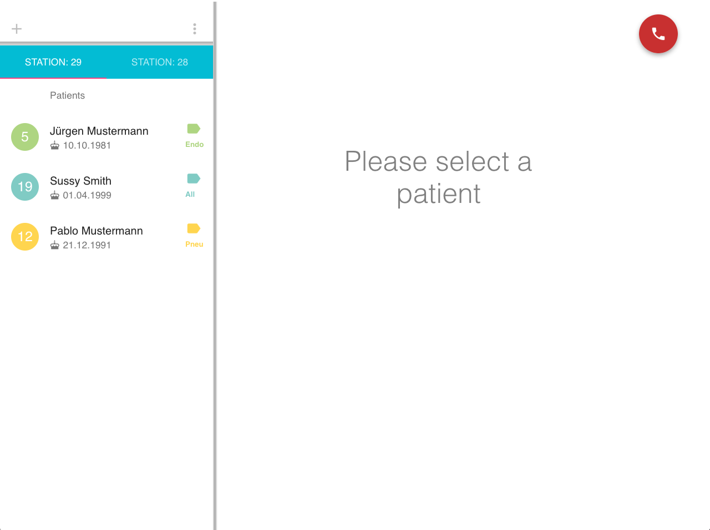
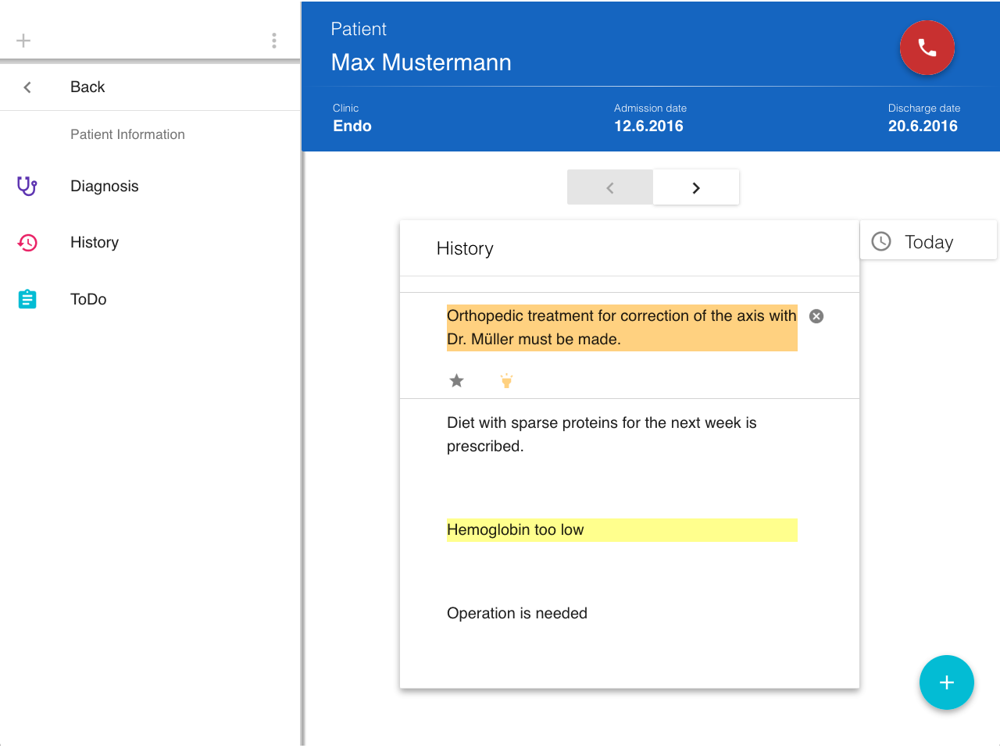

[](https://waffle.io/hotpi/frontend)
# HotPi
HotPi is a web application for patient documentation, which ensures availability even if no connection is available at all without compromising the state of the application. If a connection is available in all devices, a Google-Docs-like workflow can be experienced. 

 

## Features
HotPi leverages the browsers' APIs to bring the following features:

- Real-time collaborative work
- Offline mode
- Interactive UI
- Support of mobile devices

## Requirements
A NodeJS instance is needed to fetch all the dependencies. If you don't have one, you can get it with [`nvm`](https://github.com/creationix/nvm) or directly on [NodeJS website](https://nodejs.org/en/).

Besides, it needs a server to communicate with. We provide a [server example](https://github.com/hotpi/backend). For more information about what is needed for the server, visit the repository of our server.

## Technologies
HotPi's underlying technology to maintain consistency is [Operational Transformation](https://en.wikipedia.org/wiki/Operational_transformation)(OT). OT is also used to support real-time collaborative work.

React and Redux make together the application and [Dexie.js](https://github.com/dfahlander/Dexie.js) is used to persist data locally.


## Installation

To fetch dependencies run
```
npm install 
```
on a terminal session.

## Usage
After the dependencies have been fetched run 
```
npm start
```
to run the development server.

Now go to `http://localhost:3000` and enjoy!
